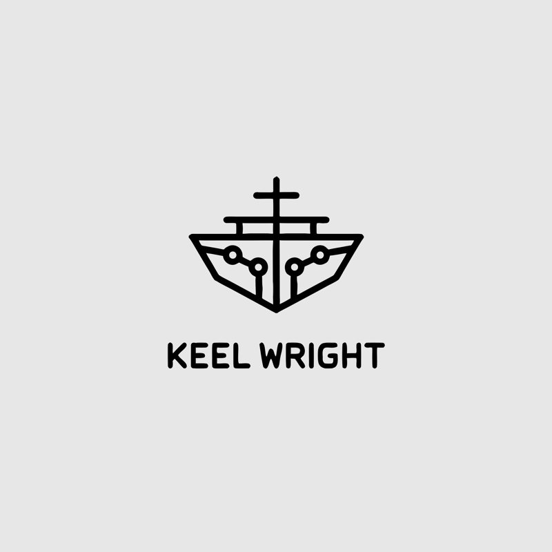

<p align="center">
  
</p>

<h1 align="center">Keelwright</h1>

<p align="center">
  <strong>A portable, tool-agnostic development methodology that makes “are we done?” answerable</strong><br>
  — on any codebase, by any AI coding agent <em>or</em> a human team.
</p>

<p align="center">
  <a href="LICENSE"></a>
  
  
  
</p>

---

Keelwright is **not a tool you run all day**. It's a **methodology you adopt** — a
lifecycle loop, a set of review gates, a documentation funnel, and a handful of
standing rituals that, together, replace *"looks done to me"* with *"here's the
verification I ran."* The core is deliberately tool-agnostic; a thin adapter maps
it onto whatever agent or toolchain you actually use.

One command gets you started — `keel init`, the way you'd run `git init`:

```sh
git clone https://github.com/mosaed-alotaibi/keelwright.git
cd my-project        # the project you want to adopt the methodology
/path/to/keelwright/keel init
```

> **The name.** A *wright* is a maker — ship**wright**, wheel**wright**,
> play**wright**. A *keel* is the backbone a vessel is built around. A
> **keelwright** lays the keel: the structural spine the whole project is built
> on. That's the job this framework does for your codebase.

---

## Why it exists

Most "done" is a vibe. Someone reads the code, it looks finished, it ships — and
the gap between *asserted* done and *verified* done is exactly where regressions,
stale docs, and 2 a.m. incidents live. That problem gets sharper, not softer, when
an AI agent is doing the work at speed.

Keelwright closes that gap with four moving parts:

| Part | What it does | Where it lives |
|---|---|---|
| **The loop** | Every change runs through `brainstorm → spec → plan → execute → verify → seal`. | [`core/04-LIFECYCLE.md`](core/04-LIFECYCLE.md) |
| **The gates** | A review must run *dry* before you stop: min 3 adversarial rounds, exit only on 2 consecutive clean. | [`core/03-REVIEW-GATES.md`](core/03-REVIEW-GATES.md) |
| **The funnel** | Docs flow `BACKLOG → ROADMAP → NEXT-STEPS → PRD`; each fact has exactly one home, so they can't drift. | [`core/01-DOC-MODEL.md`](core/01-DOC-MODEL.md) |
| **The rituals** | 16 standing habits — completion, live-verification, anti-drift, lessons-learned, … | [`core/02-RITUALS.md`](core/02-RITUALS.md) |

The principle under all of it, in one line: **quick where it's safe, cautious
where mistakes cost real work — and never claim what you haven't shown.** The full
statement is [`core/00-PHILOSOPHY.md`](core/00-PHILOSOPHY.md); every term is
defined in [`core/05-GLOSSARY.md`](core/05-GLOSSARY.md).

---

## Quick start

### 1. Get Keelwright

```sh
git clone https://github.com/mosaed-alotaibi/keelwright.git
# recommended: put `keel` on your PATH so you can run it from anywhere
ln -s "$(pwd)/keelwright/keel" /usr/local/bin/keel
```

It's **pure bash** — no Node, no Python, no install step. macOS and Linux.

### 2. Initialise a project

Run it inside the project you want to adopt — interactive, like `git init`:

```sh
cd my-project
keel init        # didn't add it to PATH? use the full path: /path/to/keelwright/keel init
```

```text
      _  __         _              _      _     _
     | |/ /___  ___| |_      ___ _(_)__ _| |_  | |_
     | ' </ -_)/ -_) | \ \/\/ / '_| / _` | ' \ |  _|
     |_|\_\___|\___|_|  \_/\_/|_| |_\__, |_||_| \__|
                                    |___/
  Keelwright v0.3.0 — the methodology that makes "are we done?" answerable.

Project name [my-project]: Acme API
Project slug (identifiers, urls) [acme-api]:
Owner / maintainer [Ada Lovelace]:
Tech stack (optional, comma-separated): TypeScript, Postgres
Repo URL [https://github.com/acme/acme-api]:
Install the Claude Code adapter (CLAUDE.md + memory + hooks)? [y/N]: y
Initialise a git repository here? [Y/n]: n

keelwright about to initialise:
  target   /Users/you/my-project
  name     Acme API
  slug     acme-api
  owner    Ada Lovelace
  stack    TypeScript, Postgres
  repo     https://github.com/acme/acme-api
  adapter  claude-code
  git init no

Proceed? [Y/n]: y
```

That single command:

1. copies the doc funnel into `docs/` (BACKLOG, ROADMAP, NEXT-STEPS, PRD,
   PROJECT_RULES, and the supporting docs), stripping the `.tmpl` suffix;
2. copies the spec + plan skeletons into `docs/spec-and-plan/`;
3. fills the placeholders it knows (`{{PROJECT_NAME}}`, `{{OWNER}}`, `{{DATE}}`, …);
4. optionally installs the **Claude Code adapter** (`CLAUDE.md`, memory seeds, a
   hook snippet to merge) and runs `git init`;
5. writes a `.keelwright/config` marker, **never overwrites** an existing file
   (use `--force`), and prints exactly which placeholders you still need to fill.

Then open `docs/NEXT-STEPS.md`, set the current cursor, and start the loop.

> **Scripting / CI?** `keel init` takes flags and a `--yes` mode so it never
> prompts: `keel init . --yes --name "Acme API" --with-cc-adapter`. Run
> `keel init --help` for the full list. The older `bootstrap/init.sh <dir> [flags]`
> entry point still works and shares the same engine.

### 3. See the destination first

Not sure what "filled in" looks like? [`examples/`](examples/) holds a complete,
populated funnel for a toy URL shortener — the end state, before you build your own.

---

## The mental model in 60 seconds

```
  GREEN BASELINE  →  prove the tree is sound before you touch anything
        │
        ▼
  BRAINSTORM → SPEC → PLAN → EXECUTE → VERIFY → SEAL
     light     full    full    light    evidence  ritual      ← each stage gets a review gate
                                                      │
                                                      ▼
              COMPLETION RITUAL before every seal / context reset
              (≥3 fresh-context audit rounds, exit on 2 consecutive clean)
```

- **Convergence is approval.** When a gate runs dry, the artifact is approved *by
  default* — proceed automatically; don't stop to ask "looks good?"
- **The author is the first reviewer, the owner is the second.** Every artifact
  passes the author's own gate *before* the owner ever sees it. The owner keeps
  genuine veto only on the decisions that bind: merges, pushes, releases, which
  goal to pursue.
- **The hand-off is always current.** A cold reader — a fresh agent session, a new
  teammate — can pick up from `NEXT-STEPS.md` at any moment without losing ground.

The docs are a funnel, so two docs can never disagree about the same fact:

```
  BACKLOG  ───▶  ROADMAP  ───▶  NEXT-STEPS  ───▶  PRD
  ideas /        the plan       how to            what the
  deferrals      (milestones    resume            system IS
  (parking lot)   + history)    (the cursor)      (as-built)
```

---

## How the repo is laid out

Keelwright keeps the durable methodology strictly separate from any one tool. Each
layer has a single job.

```
keelwright/
├── keel              ← the CLI: `keel init` bootstraps a project (run it like `git init`)
├── core/             ← TOOL-AGNOSTIC methodology — the durable "what" and "why".
│                       Reads sensibly for ANY agent OR a human team. The source of truth.
├── templates/        ← FILL-IN skeletons — the docs/specs/plans a project keeps.
│                       Pure {{PLACEHOLDERS}} + guidance, zero real content.
├── adapters/         ← TOOL-SPECIFIC mappings — the concrete "how" for one agent.
│   └── claude-code/    Maps the rituals onto real mechanics (subagents, fan-out, hooks).
├── bootstrap/        ← the install engine `keel` and `init.sh` share.
└── examples/         ← a tiny, fully-populated funnel so you can see the end state.
```

| Layer | Contains | Never contains |
|---|---|---|
| **`core/`** | Principles, doc model, rituals, gates, lifecycle, glossary. | Any specific tool's name or mechanics. |
| **`templates/`** | Skeletons with `{{PLACEHOLDERS}}` and `<!-- guidance -->`. | Real project content. |
| **`adapters/<agent>/`** | The literal moves for one agent/toolchain. | Methodology decisions (those live in `core/`). |

**Rule of thumb:** a principle goes in `core/`; a blank to fill goes in
`templates/`; anything that names a specific tool goes in `adapters/`.

---

## Adopt it · extend it

Keelwright is small on purpose — read it once, and the discipline it encodes pays
for the hour. It's also meant to be **forked and improved**:

- **Using Claude Code?** The flagship adapter is ready to go —
  [`adapters/claude-code/`](adapters/claude-code/) maps every ritual onto concrete
  subagent / Workflow / hook mechanics.
- **Using a different agent or toolchain?** Copy `adapters/claude-code/` to
  `adapters/<your-agent>/` and remap the rituals to your tool's primitives. The
  `core/` never changes — only the adapter does. PRs welcome.
- **Improving the methodology itself?** The framework is built with its *own*
  discipline. See [`CONTRIBUTING.md`](CONTRIBUTING.md) for how changes flow through
  the loop and the gates.

---

## Where to go next

- **New to the ideas?** Read [`core/00-PHILOSOPHY.md`](core/00-PHILOSOPHY.md), then
  [`core/04-LIFECYCLE.md`](core/04-LIFECYCLE.md).
- **Adopting it?** Run `keel init`, then fill the docs it lays down.
- **Using Claude Code?** Read [`adapters/claude-code/README.md`](adapters/claude-code/README.md).
- **Unsure of a term?** [`core/05-GLOSSARY.md`](core/05-GLOSSARY.md) defines them all.
- **Contributing?** [`CONTRIBUTING.md`](CONTRIBUTING.md).

See [`CHANGELOG.md`](CHANGELOG.md) for versions and [`LICENSE`](LICENSE) (MIT) for terms.
